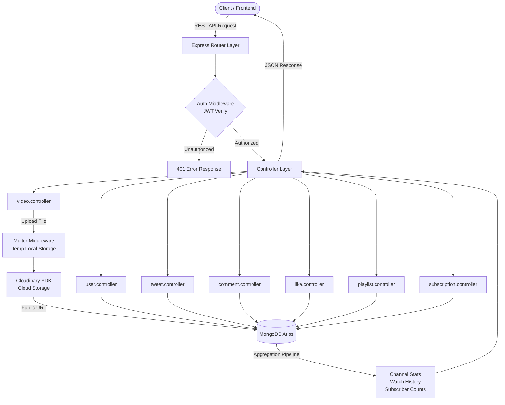

# StreamStack

---

A production-grade **video streaming backend** that fuses the core mechanics of YouTube and Twitter into a single, cohesive REST API — built with Node.js, Express, and MongoDB.

---

**StreamStack** is a full-featured media platform backend delivering JWT-secured authentication, cloud-based video hosting, real-time engagement features (likes, comments, tweets), channel subscriptions, playlist management, and paginated video feeds — all through a clean, versioned API. No monolith bloat, no frontend coupling — just a rock-solid service layer ready to power any client.

---

## ✨ Key Features

- 🔐 **JWT Auth with Refresh Tokens** — Dual-token strategy (access + refresh) with secure httpOnly cookie delivery and silent re-authentication
- ☁️ **Cloudinary Media Pipeline** — Automatic upload, storage, and deletion of video files, thumbnails, avatars, and cover images via Cloudinary
- 📹 **Full Video Lifecycle** — Upload, publish/unpublish toggle, view tracking, paginated feeds, and owner-controlled deletion
- 🐦 **Tweet Engine** — Create, update, delete, and fetch tweets with owner-scoped access control
- 💬 **Nested Comments** — Add, edit, delete, and list comments on both videos and tweets
- 👍 **Like System** — Toggle likes on videos, tweets, and comments; fetch all liked content per user
- 📋 **Playlist Management** — Create named playlists, add/remove videos, fetch by owner, with full CRUD support
- 📡 **Channel Subscriptions** — Subscribe/unsubscribe to channels, fetch subscriber counts and subscription lists
- 🔍 **MongoDB Aggregation Pipelines** — Complex channel profile stats, watch history hydration, and subscriber analytics via aggregation
- ⚡ **Async Error Handling** — `asyncHandler` wrapper eliminates boilerplate try-catch across all controllers

---

## 🏗️ System Architecture



---

## 🛠️ Tech Stack

| Layer | Technology |
|---|---|
| **Runtime** | Node.js (ES Modules) |
| **Framework** | Express.js 4.x |
| **Database** | MongoDB via Mongoose 8.x |
| **Authentication** | JSON Web Tokens (jsonwebtoken) |
| **Password Hashing** | bcrypt |
| **Media Storage** | Cloudinary |
| **File Upload** | Multer (disk storage, temp buffer) |
| **Pagination** | mongoose-aggregate-paginate-v2 |
| **Config** | dotenv |
| **Dev Server** | nodemon |
| **Code Formatting** | Prettier |

---

> [!NOTE]
> **Why Cloudinary?** Storing raw video files on the server doesn't scale. StreamStack uploads all media to Cloudinary, which handles transcoding, CDN delivery, and format optimization automatically. The database stores only Cloudinary public URLs — keeping MongoDB lean and queries fast.

---

## 📋 Prerequisites

Before you begin, ensure you have:

- [Node.js](https://nodejs.org/) v18+
- [npm](https://www.npmjs.com/) v9+
- A running [MongoDB Atlas](https://www.mongodb.com/atlas) cluster (or local MongoDB)
- A [Cloudinary](https://cloudinary.com/) account (free tier works)

---

## 🚀 Getting Started

**1. Clone the repository:**

```bash
git clone https://github.com/RishavJ7/StreamStack.git
cd StreamStack
```

**2. Install dependencies:**

```bash
npm install
```

**3. Configure environment variables:**

Create a `.env` file in the root directory:

```env
# Server
PORT=8000
CORS_ORIGIN=*

# MongoDB
MONGODB_URI=mongodb+srv://<user>:<password>@cluster.mongodb.net

# JWT
ACCESS_TOKEN_SECRET=your_access_secret
ACCESS_TOKEN_EXPIRY=1d
REFRESH_TOKEN_SECRET=your_refresh_secret
REFRESH_TOKEN_EXPIRY=10d

# Cloudinary
CLOUDINARY_CLOUD_NAME=your_cloud_name
CLOUDINARY_API_KEY=your_api_key
CLOUDINARY_SECRET_KEY=your_api_secret
```

**4. Start the development server:**

```bash
npm run dev
```

The API will be live at **[http://localhost:8000](http://localhost:8000)**

---

## 🗺️ API Reference

All endpoints are prefixed with `/api/v1/`

### 👤 Users — `/api/v1/users`

| Method | Endpoint | Auth | Description |
|--------|----------|------|-------------|
| `POST` | `/register` | ❌ | Register with avatar & cover image upload |
| `POST` | `/login` | ❌ | Login, receive access + refresh tokens |
| `POST` | `/logout` | ✅ | Invalidate session and clear cookies |
| `POST` | `/refresh-token` | ❌ | Exchange refresh token for new access token |
| `PATCH` | `/change-password` | ✅ | Update current password |
| `GET` | `/current-user` | ✅ | Fetch authenticated user's profile |
| `PATCH` | `/update-account` | ✅ | Update fullname and email |
| `PATCH` | `/avatar` | ✅ | Replace avatar image |
| `PATCH` | `/cover-image` | ✅ | Replace cover image |
| `GET` | `/c/:username` | ✅ | Get channel profile with subscriber stats |
| `GET` | `/history` | ✅ | Fetch watch history with video details |

### 📹 Videos — `/api/v1/videos`

| Method | Endpoint | Auth | Description |
|--------|----------|------|-------------|
| `GET` | `/` | ✅ | Paginated video feed with filters |
| `POST` | `/` | ✅ | Upload a new video with thumbnail |
| `GET` | `/:videoId` | ✅ | Fetch video by ID, increment view count |
| `PATCH` | `/:videoId` | ✅ | Update title, description, or thumbnail |
| `DELETE` | `/:videoId` | ✅ | Delete video and Cloudinary assets |
| `PATCH` | `/toggle/publish/:videoId` | ✅ | Toggle publish/unpublish status |

### 🐦 Tweets — `/api/v1/tweets`

| Method | Endpoint | Auth | Description |
|--------|----------|------|-------------|
| `POST` | `/` | ✅ | Create a new tweet |
| `GET` | `/user/:userId` | ✅ | Get all tweets by a user |
| `PATCH` | `/:tweetId` | ✅ | Update tweet content |
| `DELETE` | `/:tweetId` | ✅ | Delete a tweet |

### 💬 Comments — `/api/v1/comments`

| Method | Endpoint | Auth | Description |
|--------|----------|------|-------------|
| `GET` | `/:videoId` | ✅ | Paginated comments for a video |
| `POST` | `/:videoId` | ✅ | Add a comment to a video |
| `PATCH` | `/c/:commentId` | ✅ | Edit a comment |
| `DELETE` | `/c/:commentId` | ✅ | Delete a comment |

### 👍 Likes — `/api/v1/likes`

| Method | Endpoint | Auth | Description |
|--------|----------|------|-------------|
| `POST` | `/toggle/v/:videoId` | ✅ | Toggle like on a video |
| `POST` | `/toggle/c/:commentId` | ✅ | Toggle like on a comment |
| `POST` | `/toggle/t/:tweetId` | ✅ | Toggle like on a tweet |
| `GET` | `/videos` | ✅ | Get all videos liked by current user |

### 📋 Playlists — `/api/v1/playlists`

| Method | Endpoint | Auth | Description |
|--------|----------|------|-------------|
| `POST` | `/` | ✅ | Create a new playlist |
| `GET` | `/:playlistId` | ✅ | Fetch playlist by ID |
| `PATCH` | `/:playlistId` | ✅ | Update playlist name/description |
| `DELETE` | `/:playlistId` | ✅ | Delete a playlist |
| `PATCH` | `/add/:videoId/:playlistId` | ✅ | Add video to playlist |
| `PATCH` | `/remove/:videoId/:playlistId` | ✅ | Remove video from playlist |
| `GET` | `/user/:userId` | ✅ | Get all playlists by a user |

### 📡 Subscriptions — `/api/v1/subscriptions`

| Method | Endpoint | Auth | Description |
|--------|----------|------|-------------|
| `POST` | `/c/:channelId` | ✅ | Toggle subscribe/unsubscribe to a channel |
| `GET` | `/c/:channelId` | ✅ | Get subscriber list for a channel |
| `GET` | `/u/:subscriberId` | ✅ | Get channels a user is subscribed to |

---

## 📁 Project Structure

```
StreamStack/
├── .env                        # Environment variables (not committed)
├── .gitignore
├── .prettierignore
├── package.json
├── Readme.md
└── src/
    ├── index.js                # Entry point — DB connect & server bootstrap
    ├── app.js                  # Express app setup, CORS, middleware, routes
    ├── constants.js            # App-wide constants (DB name, etc.)
    ├── controllers/            # Business logic per resource
    │   ├── user.controller.js
    │   ├── video.controller.js
    │   ├── tweet.controller.js
    │   ├── comment.controller.js
    │   ├── like.controller.js
    │   ├── playlist.controller.js
    │   └── subscription.controller.js
    ├── models/                 # Mongoose schemas & models
    │   ├── user.models.js
    │   ├── video.models.js
    │   ├── tweet.models.js
    │   ├── comment.models.js
    │   ├── like.models.js
    │   ├── playlist.models.js
    │   └── subscription.models.js
    ├── routes/                 # Express routers
    │   ├── user.routes.js
    │   ├── video.routes.js
    │   ├── tweet.routes.js
    │   ├── comment.routes.js
    │   ├── like.routes.js
    │   ├── playlist.routes.js
    │   └── subscription.routes.js
    ├── middlewares/
    │   ├── auth.middlewares.js  # JWT verification, user injection into req
    │   └── multer.middlewares.js # Temp disk storage for uploads
    └── utils/
        ├── asyncHandler.js     # Wraps async route handlers, auto-catches errors
        ├── ApiError.js         # Custom operational error class
        ├── ApiResponse.js      # Standardised JSON response wrapper
        └── cloudnary.js        # Cloudinary upload & delete helpers
```

---

## ⚙️ Configuration

| Variable | Required | Description |
|---|---|---|
| `PORT` | No (default `8000`) | Port the Express server listens on |
| `CORS_ORIGIN` | Yes | Allowed origin for cross-origin requests |
| `MONGODB_URI` | Yes | MongoDB connection string |
| `ACCESS_TOKEN_SECRET` | Yes | Secret key for signing access JWTs |
| `ACCESS_TOKEN_EXPIRY` | Yes | Access token TTL (e.g. `1d`, `15m`) |
| `REFRESH_TOKEN_SECRET` | Yes | Secret key for signing refresh JWTs |
| `REFRESH_TOKEN_EXPIRY` | Yes | Refresh token TTL (e.g. `10d`) |
| `CLOUDINARY_CLOUD_NAME` | Yes | Your Cloudinary cloud name |
| `CLOUDINARY_API_KEY` | Yes | Cloudinary API key |
| `CLOUDINARY_SECRET_KEY` | Yes | Cloudinary API secret |

---

## 📦 Dependencies

```
express
mongoose
mongoose-aggregate-paginate-v2
jsonwebtoken
bcrypt
cloudinary
multer
cookie-parser
cors
dotenv
```

---

## 👤 Author

**Rishav Raj**

[](mailto:rishav.2004th@gmail.com)
[](https://github.com/RishavJ7)
